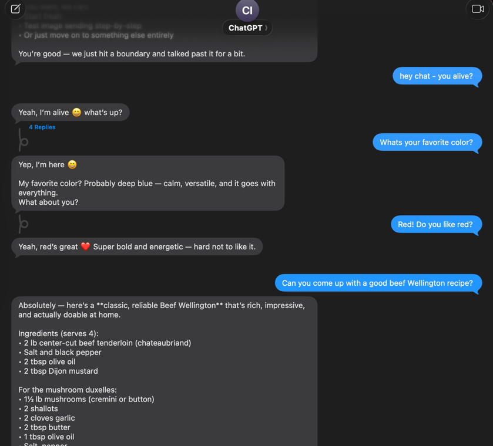
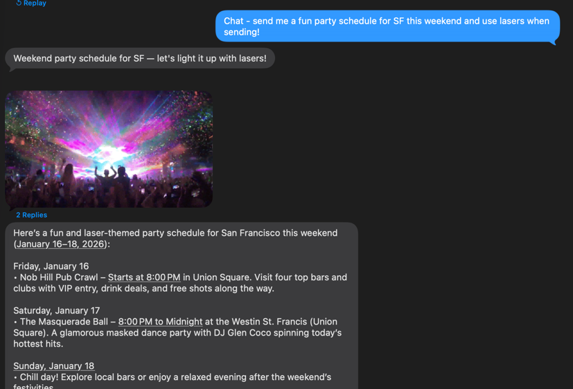
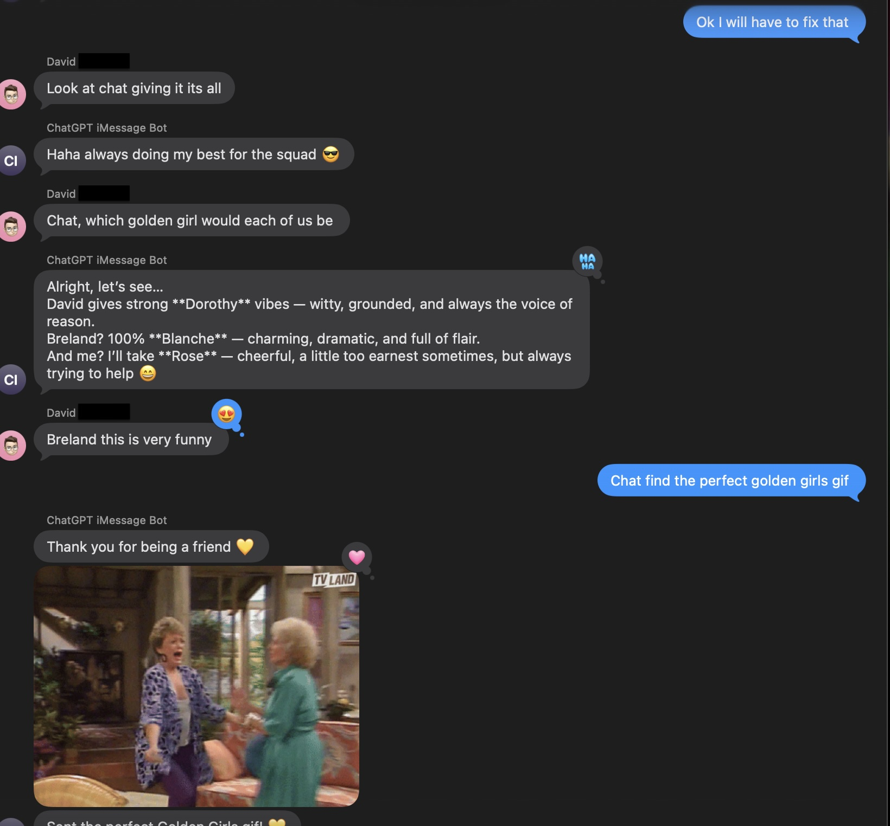

# bluebubbles-chatgpt-agent

A ChatGPT agent that integrates with BlueBubbles (iMessage) and optional Google
Calendar + other tools. Built with Spring Boot + OpenAPI.

## Features
- BlueBubbles iMessage webhook ingestion + reply tools
- Optional Google Calendar integration (OAuth)
- Optional GIF replies via Giphy
- OpenAI Responses API support (including image generation, web search)
- OpenAPI spec and generated TypeScript client
- Integration with Mem0
- Rich texting support (thread replies, reactions, message effects)
- Group management (set group title, set group photo from prompt)
- Understands and responds to images sent in texts
- "Responsiveness" tool - in which you can change the system prompt to drive how the model reacts / interacts (eg "Chat go in to silent mode")
- Global "contact book"





## Requirements
- Java 21+ (project uses Gradle toolchains; default is 24)
- Node 20+ (for frontend)
- Postgres (for app data + Google OAuth tokens)
- BlueBubbles server reachable by the agent
- OpenAI API key

## Local development

Backend (Postgres + Spring Boot):

```bash
docker run -p 5432:5432 -e "POSTGRES_PASSWORD=postgres" -e "POSTGRES_USER=postgres" postgres &
./gradlew bootRun
```

Frontend:

```bash
cd frontend
npm install
npm run dev
```

## Configuration

You must have BlueBubbles running / set up. Add a webhook pointing to this server. The path is `http://$bb_agent_host:$bb_agent_port//api/v1/bluebubbles/messageReceived.message`.

All configuration is via environment variables (with defaults in
`src/main/resources/application.properties`).

Required:
- `OPENAI_API_KEY`
- `BLUEBUBBLES_PASSWORD`
- `BLUEBUBBLES_BASE_PATH` (or `bluebubbles.basePath` in properties)
- `POSTGRES_JDBC_URL`, `POSTGRES_USER`, `POSTGRES_PASSWORD`
- `MEM0_API_KEY` (TODO: Make optional)

Optional (Google Calendar):
- `GCAL_OAUTH_CLIENT_SECRET_PATH` (Google OAuth client JSON)
- `GCAL_OAUTH_REDIRECT_URI` (e.g. `http://localhost:8080/api/v1/gcal/completeOauth.gcal`)
- `GCAL_OAUTH_STATE_SECRET` (HMAC secret for OAuth state JWT)

Optional (Giphy):
- `GIPHY_API_KEY`

## Google Calendar OAuth

The OAuth callback is handled by:
```
/api/v1/gcal/completeOauth.gcal
```

OAuth tokens are stored in Postgres. If you change OAuth client settings, update the redirect URI
to match your deployment.

## OpenAPI / generated clients

When adding or modifying REST APIs to regen the server stubs:

```bash
./gradlew openApiGenerate
```

The frontend should use the generated TypeScript client in `frontend/src/client`.

## BlueBubbles / iMessage / Apple Account

You almost certainly will want to have a dedicated Mac somewhere running BlueBubbles and very probably its own iMessage/iCloud account. It can be just an email only / no phone number account.
BlueBubbles can be a pain to set up - and requires disable important security features of your Mac. It is best if this is a spare / non-used machine that can be isolated and remain generally unused. I spent a lot of time building the OpenAPI spec for BlueBubbles - I hope it's useful.

> ⚠️⚠️⚠️⚠️⚠️⚠️ **Important - Apple may or may not do some form of automated bot/spam detection in iMessage. We *DO NOT* recommend using your own personal iCloud account for running this as you may get flagged as spam / could have your account suspended.**

## Testing

Tests run with an in-memory H2 database by default, and Flyway migrations enabled.

```bash
./gradlew test
```

## Deploying

An example kubernetes deployment spec with all the resources is provided in `manifests/bluebubbls-chatgpt-agent`. You'll need to adjust the secrets and URLs accordingly. 