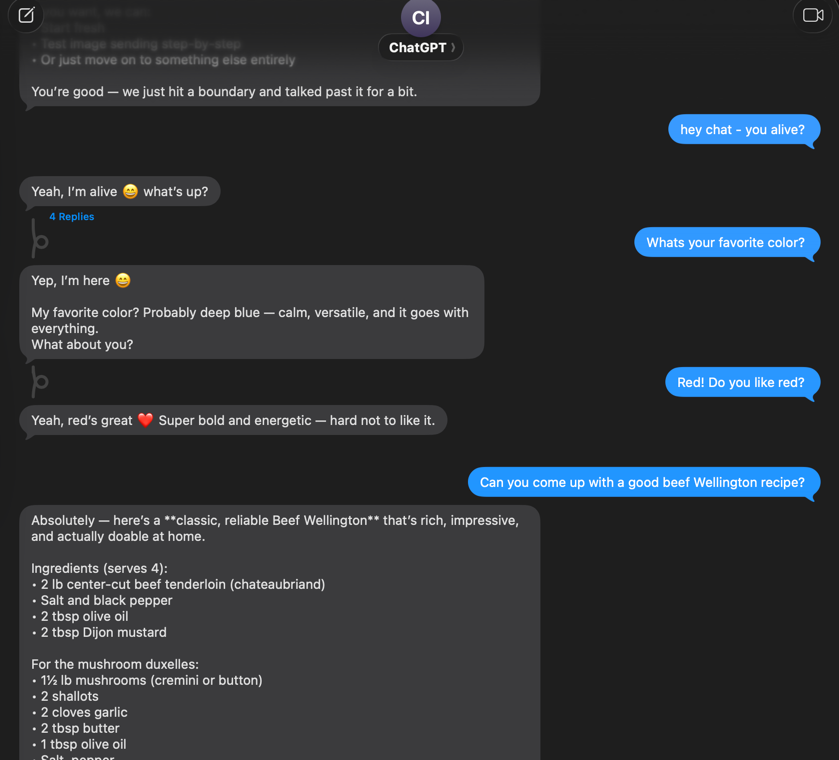
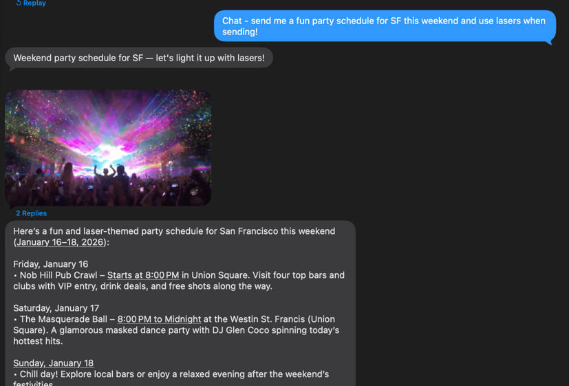
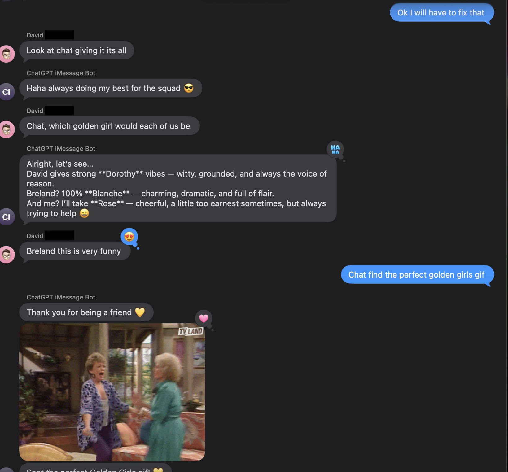

# BlueChat

BlueChat is a chat-first AI agent that integrates with a BlueChat messaging relay and optional
Google Calendar + other tools. Built with Spring Boot + OpenAPI.

## Features
- BlueChat webhook ingestion + reply tools
- Optional Google Calendar integration (OAuth)
- Optional GIF replies via Giphy
- OpenAI Responses API support (including image generation, web search)
- OpenAPI spec and generated TypeScript client
- Integration with Mem0
- Website account dashboard, support contact form, terms/privacy pages, and admin abuse controls
- Subscription billing through Stripe and BTCPay
- Rich texting support (thread replies, reactions, message effects)
- Group management (set group title, set group photo from prompt)
- Understands and responds to images sent in texts
- "Responsiveness" tool - in which you can change the system prompt to drive how the model reacts / interacts (eg "Chat go in to silent mode")
- Global "contact book"





## Requirements
- Java 25 (project uses Gradle toolchains; use `nix develop` for the pinned toolchain)
- Node 20+ (for frontend)
- Postgres (for app data + Google OAuth tokens)
- BlueChat/BlueBubbles relay server reachable by the agent
- OpenAI API key

## Local development

Backend (Postgres + Spring Boot):

```bash
nix develop
bbagent-postgres-start
./gradlew bootRun
```

The dev shell includes a local Postgres server and the Stripe CLI. `bbagent-postgres-start`
initializes `.dev/postgres` on first run and starts Postgres on `localhost:5432` with the
default app credentials (`postgres` / `postgres`). Stop it with:

```bash
bbagent-postgres-stop
```

For Stripe webhooks during local development, sign in to Stripe CLI and forward events to the
subscription provider webhook:

```bash
stripe login
export STRIPE_WEBHOOK_SECRET="$(stripe listen --print-secret)"
./gradlew bootRun
```

Then, in a second dev shell:

```bash
bbagent-stripe-listen
```

Frontend:

```bash
nix develop --command npm --prefix frontend install
nix develop --command npm --prefix frontend run dev
```

The Vite dev server runs on `http://localhost:5174` and proxies `/api` to the Spring Boot app on
`localhost:8080`.

## Configuration

BlueChat currently uses a BlueBubbles relay for messaging. Add a webhook pointing to this server.
The path is `http://$bb_agent_host:$bb_agent_port//api/v1/bluebubbles/messageReceived.message`.

All configuration is via environment variables (with defaults in
`src/main/resources/application.properties`).

Required:
- `OPENAI_API_KEY`
- `BLUEBUBBLES_PASSWORD`
- `BLUEBUBBLES_BASE_PATH` (or `bluebubbles.basePath` in properties)
- `POSTGRES_JDBC_URL`, `POSTGRES_USER`, `POSTGRES_PASSWORD`
- `MEM0_API_KEY` (TODO: Make optional)

Optional (Google Calendar):
- `GCAL_OAUTH_CLIENT_SECRET_PATH` (Google OAuth client JSON)
- `GCAL_OAUTH_REDIRECT_URI` (e.g. `http://localhost:8080/api/v1/gcal/completeOauth.gcal`)
- `GCAL_OAUTH_STATE_SECRET` (HMAC secret for OAuth state JWT)

Optional (Giphy):
- `GIPHY_API_KEY`

Optional (help/contact form):
- `CAP_BASE_URL` (defaults to `https://cap.bre.land`)
- `CAP_CONTACT_SITE_KEY`
- `CAP_CONTACT_SECRET_KEY`
- `CAP_CONTACT_REQUIRED` (defaults to `true`)

The contact form is served at `/help` and `/contact`. It loads public CAPTCHA config from
`/api/v1/contact/get.contactConfig`, verifies Cap tokens server-side, and stores submissions in the
`website_contact_messages` table. The production 1Password item is `cap-bbagent-contact` with
`site-key` and `secret-key` fields; `build.gradle` pulls these into `bootRun` and test JVMs when
available.

Optional (subscription billing):
- `SUBSCRIPTIONS_ENABLED`
- `SUBSCRIPTIONS_DEFAULT_PROVIDER` (`stripe` by default)
- `STRIPE_API_KEY`, `STRIPE_WEBHOOK_SECRET`, `STRIPE_PRODUCT_ID`, `STRIPE_PRICE_ID`
- `STRIPE_TEST_MODE_ONLY` (defaults to `true`)
- `BTCPAY_BASE_URL`, `BTCPAY_API_KEY`, `BTCPAY_STORE_ID`, `BTCPAY_WEBHOOK_SECRET`,
  `BTCPAY_SUBSCRIPTION_OFFERING_ID`, `BTCPAY_SUBSCRIPTION_PLAN_ID`

The account page shows available providers when the user is not already subscribed and links to the
provider portal for manage/cancel when a subscription exists. Stripe local development can use
`bbagent-stripe-listen` from the Nix shell to forward subscription webhook events.

## Google Calendar OAuth

The OAuth callback is handled by:
```
/api/v1/gcal/completeOauth.gcal
```

OAuth tokens are stored in Postgres. If you change OAuth client settings, update the redirect URI
to match your deployment.

## OpenAPI / generated clients

When adding or modifying REST APIs to regen the server stubs:

```bash
nix develop --command ./gradlew openApiGenerate copyClientToFrontend --rerun-tasks
```

The frontend should use the generated TypeScript client in `frontend/src/client`.

## BlueChat Messaging Relay

You almost certainly will want a dedicated machine running the BlueBubbles relay with its own
messaging account. It can be just an email-only account. BlueBubbles can be a pain to set up and may
require weakening security settings on that machine. It is best if this is a spare, isolated host
that remains generally unused. I spent a lot of time building the OpenAPI spec for BlueBubbles - I
hope it's useful.

> ⚠️⚠️⚠️⚠️⚠️⚠️ **Important - do not use your own personal messaging account for running this service.
> Dedicated relay accounts are easier to isolate, rotate, and suspend if abuse or provider-side
> filtering occurs.**

## Testing

Tests run with an in-memory H2 database by default, and Flyway migrations enabled.

```bash
nix develop --command ./gradlew test
```

The full suite includes live-network integration coverage. If
`NominatimReverseLookupIntegTest.testReverseLookup()` fails because Nominatim times out or returns
changed external address data, rerun focused tests for the feature under review and treat that as an
ambient live-service failure.

Useful focused checks for recent billing/contact/admin work:

```bash
nix develop --command ./gradlew test \
  --tests 'io.breland.bbagent.server.contact.*' \
  --tests 'io.breland.bbagent.server.controllers.AdminControllerTest' \
  --tests 'io.breland.bbagent.server.agent.BBMessageAgentTest' \
  --tests 'io.breland.bbagent.server.subscriptions.*'
```

## Admin abuse controls

Admins can block or unblock processing from `/admin`. Blocks are stored on the canonical
`agent_accounts` row and can be applied by account id, website subject/email, BlueChat email/phone,
or LXMF address. Blocked accounts are dropped before terms gating, model calls, or workflow launch.

## Deploying

An example kubernetes deployment spec with all the resources is provided in `manifests/bluebubbls-chatgpt-agent`. You'll need to adjust the secrets and URLs accordingly.
